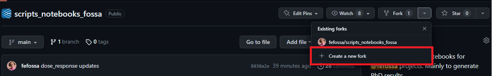
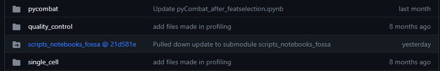
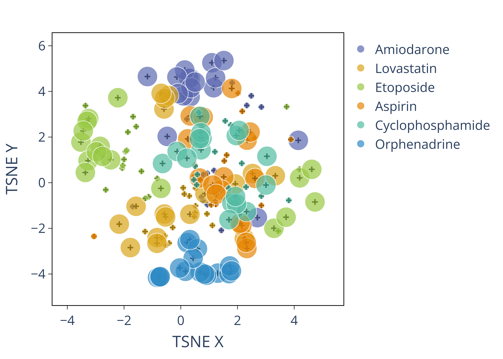
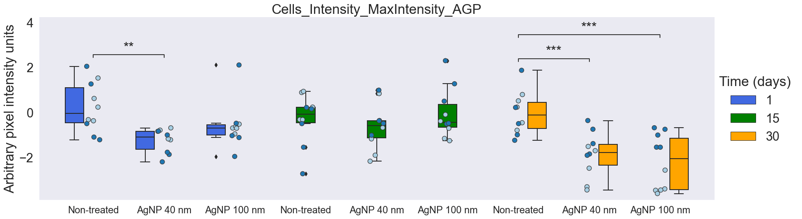
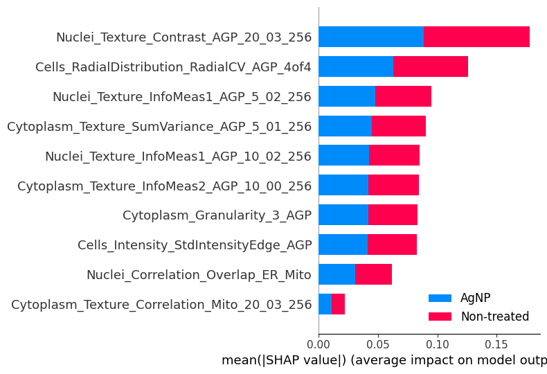
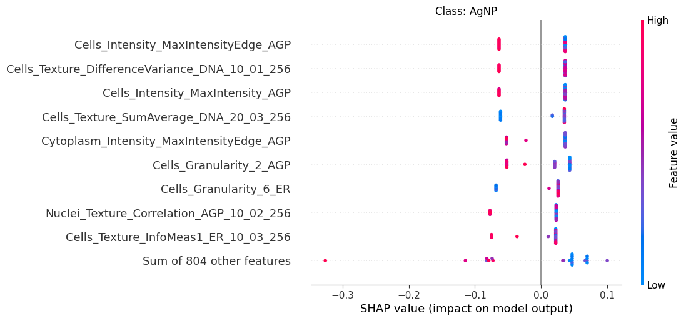

# Bioimage and data analysis scripts

The scripts and notebooks in this repository were created by @fefossa to support the projects developed during her Ph.D. It was developed during an internship at Cimini Lab and Carpenter-Singh Lab. 

Inside each folder, it contains a set of Python functions related to each subproject that can be applied to different use cases.

Before following the instructions, make sure:

a) You have [git](https://git-scm.com/downloads) installed;

b) Create a **main repository** to perform your analysis, and to be able to use `scripts_notebooks_fossa` as a submodule. Follow [these instructions](https://docs.github.com/en/get-started/quickstart/create-a-repo) to create your first repo.

c) I recommend to use [GitHub Desktop](https://desktop.github.com/) to manage your repositories locally. See this [video](https://www.youtube.com/watch?reload=9&v=8w79Gkm-x-c&ab_channel=C%C3%B3digoLogo) for a tutorial. 

## 1. Instructions

1. Create your [fork](https://docs.github.com/en/get-started/quickstart/fork-a-repo) of the repository `scripts_notebooks_fossa`:

    

    Result: The fork creates a copy of a this repository into your account that looks like:
    ```
    https://github.com/$YOUR_USERNAME/scripts_notebooks_fossa.git
    ```

<details>
<summary>macOS/linux</summary>
<br>

2. Create a submodule inside your own analysis repository

    1. Clone the **main repo** you created in (b):

        ```
        YOUR_USERNAME="INSERT-USERNAME-HERE"
        REPO="INSERT-NAME-HERE"
        git clone git@github.com:$YOUR_USERNAME/$REPO.git
        ```
    2. Open the Command Prompt window, `cd` to your repo locally, and add the submodule:
        
        ```
        cd $REPO
        git submodule add https://github.com/$YOUR_USERNAME/scripts_notebooks_fossa.git scripts_notebooks_fossa
        ```
    
    3. In your **main repository**, you'll see `scripts_notebooks_fossa` like:
    

3. Create a new environment called `bioimage_scripts` using conda

    1. Download [miniconda](https://docs.conda.io/en/latest/miniconda.html);

    2. Open the Anaconda prompt and `cd` to the repo;
        
        ```
        cd $REPO/scripts_notebooks_fossa
        ```
    3. Paste the following into the command prompt:
        ```
        conda env create --file environment.yml 
        ```

    4. Run the notebooks available here inside this environment:
        ```
        conda activate bioimage_scripts
        ```
</details>

<details>
<summary>Windows</summary>
<br>

2. Create a submodule inside your own analysis repository

    1. Clone the **main repo** you created in (b):
    
        ```
        set YOUR_USERNAME="INSERT-USERNAME-HERE"
        set REPO="INSERT-NAME-HERE"
        git clone git@github.com:%YOUR_USERNAME%/%REPO%.git
        ```
     2. Open the Command Prompt window, `cd` to your repo locally, and add the submodule:

        ```
        cd %REPO%
        git submodule add https://github.com/%YOUR_USERNAME%/scripts_notebooks_fossa.git scripts_notebooks_fossa
        ```
    
    3. In your **main repository**, you'll see `scripts_notebooks_fossa` like:
    

3. Create a new environment called `bioimage_scripts` using conda

    1. Download [miniconda](https://docs.conda.io/en/latest/miniconda.html);

    2. Open the Anaconda prompt and `cd` to the repo;

        ```
        cd %REPO%/scripts_notebooks_fossa
        ```

    3. Paste the following into the command prompt:
        ```
        conda env create --file environment.yml 
        ```

    4. Run the notebooks available here inside this environment:
        ```
        conda activate bioimage_scripts
        ```
</details>

## 2. Use the Python functions inside a Jupyter Notebook

Inside each folder, there is an example notebook and an overall description.

To use any function inside a notebook, paste the following and change the path to your **main repo**:

```
import sys
sys.path.append(r"C:\Users\REPO")
```

To import a utilitary Python file from any folder, use:

```
from scripts_notebooks_fossa.pycombat_umap import combat_util
```

## 3. Details for each folder

### 0. Metadata
**metadata folder:**
Notebooks and executable programs to:
    
    1. Generate a metadata file from layout of a plate containing all the info about the assay (**metadata_from_layout_program**);

    2. Generate a load csv file with the location of the images split by channel, and metadata info from Plate, Well, and Site.


### 1. Profile generator for CellProfiler and DeepProfiler outputs
**profiles folder:**
It has one folder for each software output, but the idea is the same for both. There are two notebooks:

- 1_Samples_retrieval.ipynb: get the single cells extracted from a database file (.sqlite) from all the plates in the batch, and join them into one CSV file;

- 2_AggAnnNormFeat.ipynb: from the single cell data, aggregate, annotate, normalize, and feature select the dataset using [pycytominer](https://github.com/cytomining/pycytominer). More details inside the notebook. 

### 2. Batch correct and visualize profiles
**pycombat_umap folder:**
It will process well-aggregated profiles and apply batch correction using PyCombat, and then use UMAP for visualization.
  
- **combat_util.py** file: functions that accept DataFrames (pandas library). The requirements are pycytominer, pandas, plotly.express, and UMAP.

- For more details on environment settings, see the readme inside the folder.

- Run TSNE and UMAP for the number of iterations determined and plot the mean embedding and standard deviation.

- Example of a plot:



### 3. Visualize samples replicability (mean average precision (mAP) results)
**plot_map folder:**
Give the main folder as an input, and looks in the subdirectories to find the files with the mAP x q values. 

- To calculate the mAP, use the instructions contained in the [evalzoo](https://github.com/cytomining/evalzoo/tree/main/matric).
  
- Then, use **plot_qvalue_map.ipynb** to plot the mAPs. Choose the title of the plot and save it.

- Example of the output:


### 4. Correlation matrix 
**correlation_matrix folder:** 
Here we have functions to calculate and generate a Pearson correlation matrix per plate or per dataset. 


### 5. Dose-response (IC50)
**dose_response folder:** 
Create a dose-response curve based on concentration and cell viability values. Using linear regression, we calculate the linear function that represents that curve and get the IC50 (Inhibitory Concentration of 50% of the population). 


### 6. Plot single features
**individual_feature_and_statistics folder:**
Plot boxplots with each sample colored by the batch with the option to annotate with statannotations.



### 7. Machine learning
**machine_learning folder:**
Example of running a Random Forest model to find the feature importance between groups and the shap value.





# APPENDIX: Submodules tips

## To update a submodule that's inside your main repo

#cd $REPO
#git submodule update --init --recursive

Follow this link https://gist.github.com/gitaarik/8735255#make-changes-inside-a-submodule

## To clone an analysis repo with its submodules

git clone --recurse-submodules git@github.com:$YOUR_USERNAME/$REPO.git 